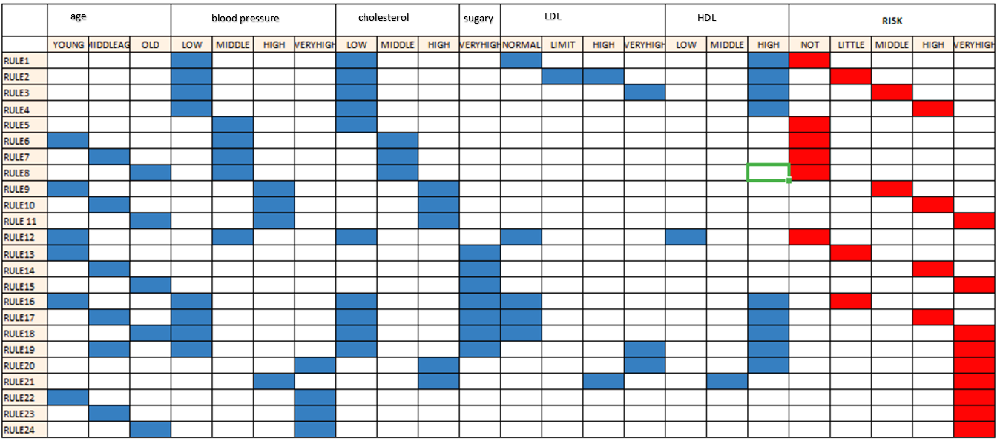
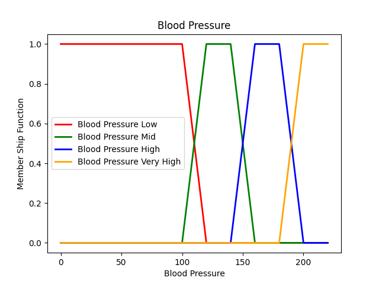
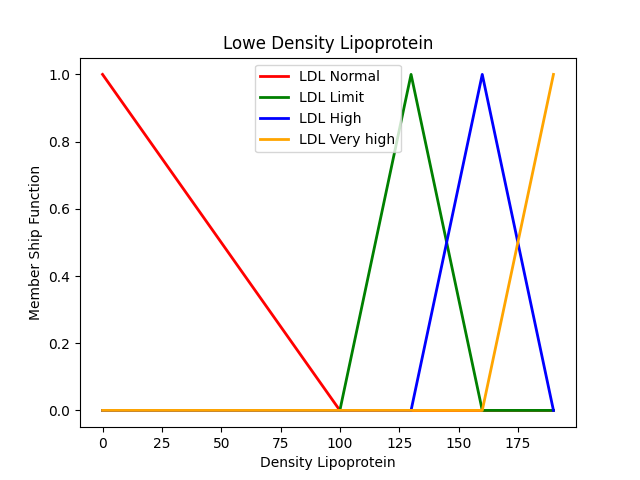
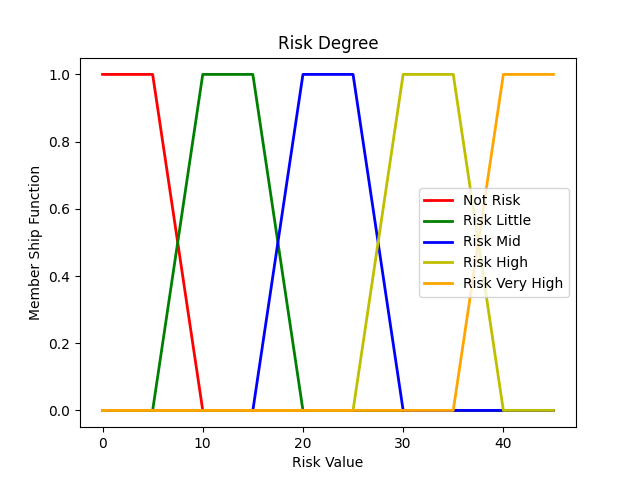
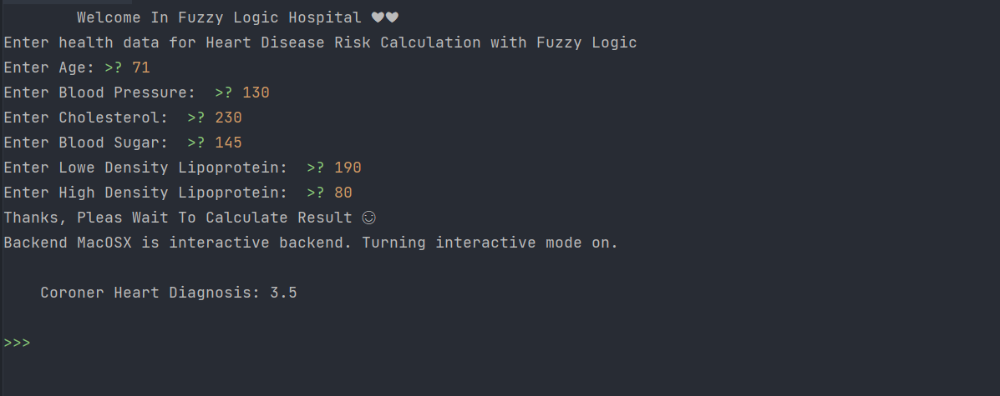
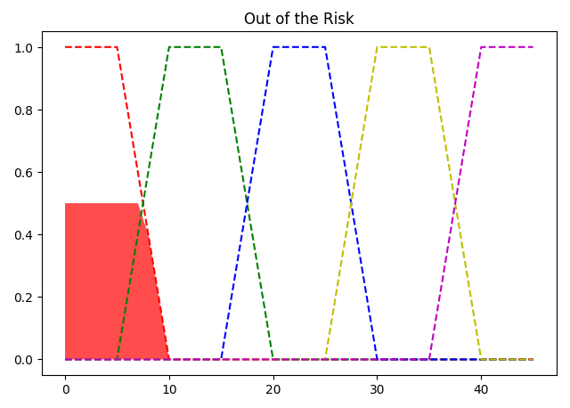
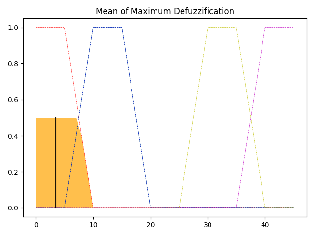

# Heart Diagnosis
This Fuzzy Logic In this study, a fuzzy system was designed to determine the risk of heart disease.
The system consists of _**24 rule bases**_ and has a **MISO** (Multi Input Single Output) 
system structure consisting of **_`6 inputs`_** - single outputs. 
Input values of the person; age, blood pressure, cholesterol, blood sugar, LDL and HDL values. 
The output value consists of the “**_`risk`_**” Fuzzy extraction engine and the center of gravity rinser.
The risk of heart disease is calculated by applying the necessary procedures to the information received from the user.

### The Rules Table

## Input Ranges
| Input                    |   Range    | MFs |
|--------------------------|:----------:|----:|
| Age                      |  0 To 100  |   3 |
| Blood Pressure           |  0 To 220  |   4 |
| Cholesterol              | 100 To 250 |   3 |
| Blood Sugar              |  0 To 120  |   1 |
| High Density Lipoprotein |  0 To 70   |   3 |
| Lowe Density Lipoprotein |  0 To 190  |   4 |

### Inputs

 
 
 

## Output Range
| Output |  Range  | MFs |
|--------|:-------:|----:|
| Risk   | 0 To 45 |   5 |

### Risk 

#### Test System

 **I tried our model with these data 👇 and It calculated Coroner Heart Diagnosis value is 3.5 .
 So in this example, this people has no risk for Coroner Heart Disease.**

 
 
**These Defuzzification are relative to the previous inputs 👆**

 

### Represent crisp and sense something _As Figure_
 
 

 # References
 * Matplotlib Python
   - https://matplotlib.org/
 * Numpy Python
   - https://numpy.org/
 * Skfuzzy Python
   - https://pythonhosted.org/scikit-fuzzy/
 * Fuzzy inference systems
   - https://www.cs.princeton.edu/courses/archive/fall07/cos436/HIDDEN/Knapp/fuzzy004.htm
 
